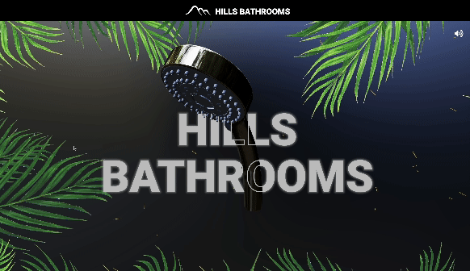

# Hills Bathroom Landing Page

## Website

[https://hbr-threejs-website.vercel.app/](https://hbr-threejs-website.vercel.app/)

## Preview



## Description

This is a landing page created for Hills Bathroom Renovations mainly using @react-three/fiber, @react-three/drei, @react-spring and three

## Running the Project Locally

### 1. Prerequisites

Before running the project, ensure you have the following installed:

- Node.js (v20.11.0)
- npm (10.2.4)

### 2. Clone the Repository

```bash
git clone https://github.com/gsahlieh/hbr-threejs-website.git &&
cd hbr-threejs-website
```

### 3. Install packages

```bash
npm i
```

### 3. Run locally

```bash
npm run dev
```
